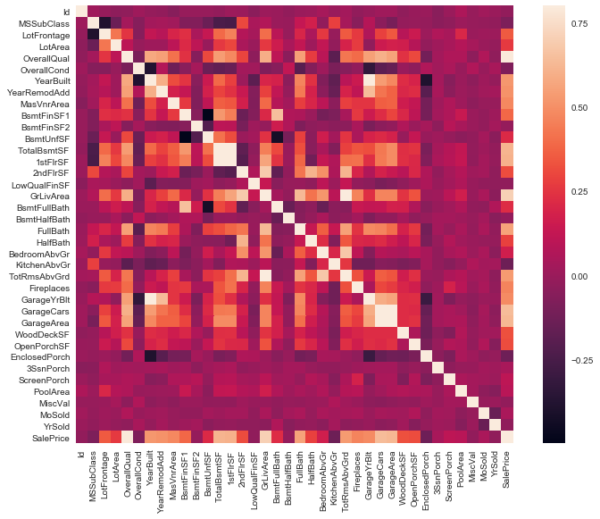
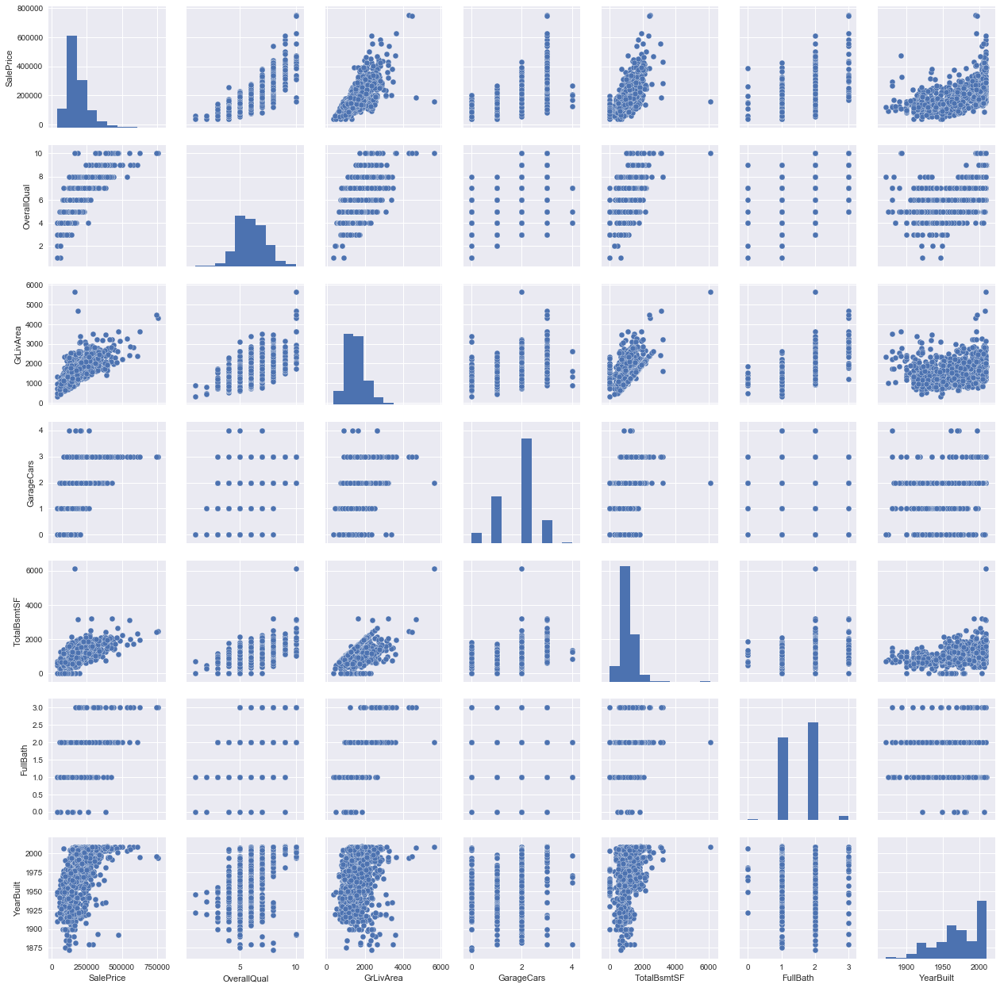

# Exploratory-Data-Analysis

Exploratory Data Analysis (EDA) is an approach to analyzing data sets to summarize their main characteristics, often with visual methods [[1]](https://en.wikipedia.org/wiki/Exploratory_data_analysis). It refers to the critical process of performing initial investigations on data so as to discover patterns, to spot anomalies, to test hypothesis and to check assumptions with the help of summary statistics and graphical representations [[2]](https://towardsdatascience.com/exploratory-data-analysis-8fc1cb20fd15)

The main pillars of EDA are data cleaning, data preparation, data exploration, and data visualization.

## Examples

  

  

