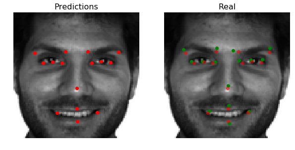

# Computer Vision

Facial Key Points (FKPs) Detection is an important and challenging problem in the fields of computer vision and machine learning. It involves predicting the co-ordinates of the FKPs, e.g. nose tip, center of eyes, etc, for a given face.

In this project we are going to implement the building blocs used in almost every computer vision project, as well as a ResNet case study where we combine the knowledge of computer vision techniques and deep learning to build and end-to-end facial keypoint recognition system using the FKP dataset from Kaggle.

- *face_detect.py* : Given an image, the function detects the existing faces and locates the positions of eyes in these faces

- *evaluation.py*  : For evaluation. Given a model and an image, plot the facial key points

- *edge_detector*  : Edge detection is a dimension reduction technique - by keeping only the edges of an image we get to throw away a lot of non-discriminating information

- *hide_identity.py*  : The function hide (blur) the existing faces in a given image

- *preprocess_data.ipynb* : Preprocess the data before training our FKP model

- *computer_vision_V0.ipynb* : Basic manipulations of the dataset

- *computer_vision_V1.ipynb* : The core model, using ResNet as NN architecture & Keras

To sum up, in this project we discovered the OpenCV library, pre-processed data, and familiarized with basic building blocs of face detection projects. Furthermore, we trained a Convolutional Neural Network (CNN) to detect facial keypoints.

  

