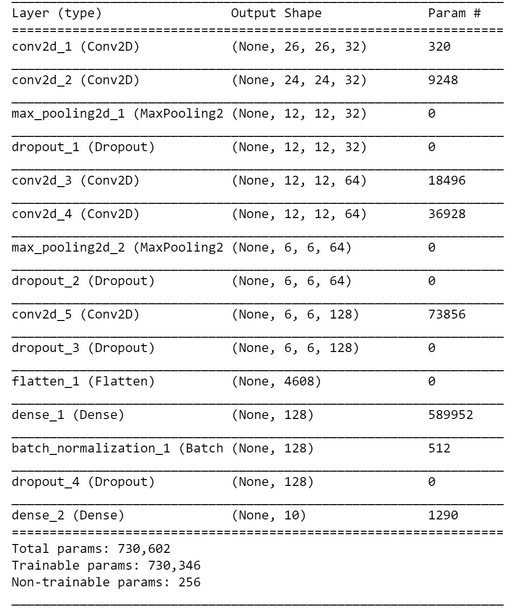
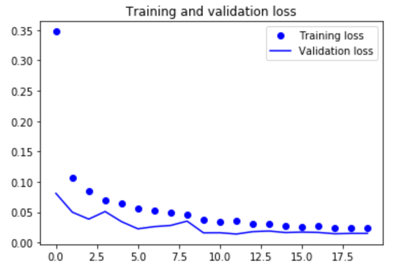

# kaggle_mnist_cnn

The MNIST database is a large database of handwritten digits that is commonly used for training various image processing systems. 
In this project we explore this database and train a CNN in order to be able to detect new handwritten digits. We got a final accuracy of  0.995 and posted oud result to the Kaggle community.

Google's Kaggle it is an online plateform of data science and machine learning geeks. It allows users to find and publish data sets, explore and build modelst, work with other data scientists and machine learning engineers, and enter competitions to solve data science challenges.

## Model

  

## Results

  

